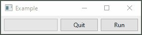

<table>
  <tr>
    <td width="9999px" align="center">
      

         
        
      

      <h1>pysidorado</h1>
      
Easy and simple PySide samples for everyone.

    </td>
  </tr>
</table>

<h2 align="center">Samples</h2>

<table>
  <tr>
    <td width="9999px" align="center">      
      <a href="src/fixed_windows_buttons.py">fixed_windows_buttons</a>
    </td>
  </tr>
  <tr>
    <td width="9999px" align="center">
      

         
        
      

    </td>
  </tr>
</table>

<table>
  <tr>
    <td width="9999px" align="center">      
      <a href="src/progress_window.py">progress_window</a>
    </td>
  </tr>
  <tr>
    <td width="9999px" align="center">
      

         
        
      

    </td>
  </tr>
</table>