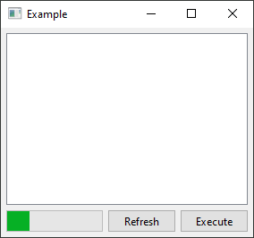

<table>
  <tr>
    <td width="9999px" align="center">
      

         
        
      

      <h1>pysidorado</h1>
      
Easy and simple PySide samples for everyone.

    </td>
  </tr>
</table>

## fixed_windows_buttons

